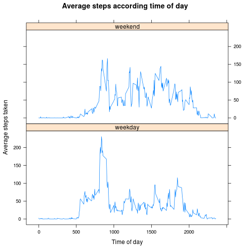

# Reproducible Research: Peer Assessment 1


## Loading and preprocessing the data

First we load the data:


```r
act <- read.csv("activity.csv")
data <- na.omit(act)  
```
`act` is data frame containing na's which will be treated after. `data`
is a data frame subset of `act` whose rows do not contain the na's of
`act`.


## What is mean total number of steps taken per day?

First, we compute the total of steps taken in each day:

```r
steps.by.day <- aggregate(list(steps=data$steps),
                          by = list(date=data$date), sum)
head(steps.by.day)
```

```
##         date steps
## 1 2012-10-02   126
## 2 2012-10-03 11352
## 3 2012-10-04 12116
## 4 2012-10-05 13294
## 5 2012-10-06 15420
## 6 2012-10-07 11015
```

Whose distribution would be characterised by the following histogram:
 

The values of the mean and the median are:

```
## [1] 10766
```

```
## [1] 10765
```

## What is the average daily activity pattern?

First we compute the average by day and by each interval of time:

```r
steps.avg.by.day <- aggregate(list(avg=data$steps),
                              by=list(interval=data$interval), mean)
head(step.avg.by.day)
```

```
##   interval     avg
## 1        0 1.71698
## 2        5 0.33962
## 3       10 0.13208
## 4       15 0.15094
## 5       20 0.07547
## 6       25 2.09434
```

Now we plot the average through of the time of a day:
 

We examine the maximum 5-minute interval is:

```
## [1] 206.2
```
Corresponding to

```
## 8 hours and 35 minutes
```


## Imputing missing values

In this part we want to have an idea about the potential bias that could
have introduced the na's rows. In order to see that, we will fill each
na entry with the mean of the given interval.

First we count the rows with missing values:

```
## There are 2304 row with missing values
```
As we see, there is a important quantity, what suggests evaluate the
potential bias.

Only the column "steps" has missing values, not the others two, as showed
by:

```r
length(which(is.na(act$interval)))
```

```
## [1] 0
```

```r
length(which(is.na(act$date)))
```

```
## [1] 0
```

Our strategy for filling missing values will consist in inputting the
missing values with the mean for the 5-minute interval. In order to do
that, we must first compute the means for each interval as follows:

```r
means.for.interval <- aggregate(list(avg=data$steps),
                                by = list(interval=data$interval), mean)
```

Now we input the missing values of the data frame `act`:

```r
for (i in which(missing.values)) { # for each row of act having a na entry
    interval <- act$interval[i]                      # get the 5-minute interval
    index <- means.for.interval$interval == interval # get its index in means
    act$steps[i] <- round(means.for.interval$avg[index]) 
    }
```

Now we totalize the number of steps taken by day for the filled data
frame (`act`):

```r
new.steps.by.day <- aggregate(list(steps=act$steps),
                              by = list(date=act$date), sum)
```

Finally, we examine the histogram for the new data set in order to
visualize the distribution:
 

### What is the impact of imputing missing data on the estimates of the total daily number of steps?

The similarity between this data set and the previous (with the na's
removed) suggests that practically **there is no impact** in the
distribution. The difference for the frequency is obvious taking in
account that the filling increases the number of samples.


## Are there differences in activity patterns between weekdays and weekends?

In order to answer this, we first add a new column to filled data set
(`act`):

```r
set.weekday <- function(date) {      # return if date is weekday or weekend
    day.name <- weekdays(date)
    if (day.name == "Saturday" | day.name == "Sunday")
        "weekend"
    else
        "weekday"
    }

new.col <- as.factor(sapply(as.Date(act$date), set.weekday)) # new factor column
act <- cbind(act, new.col)     # add new column to act data frame
colnames(act)[4] <- "Day.Type" # rename new column
head(act)
```

```
##   steps       date interval Day.Type
## 1     2 2012-10-01        0  weekday
## 2     0 2012-10-01        5  weekday
## 3     0 2012-10-01       10  weekday
## 4     0 2012-10-01       15  weekday
## 5     0 2012-10-01       20  weekday
## 6     2 2012-10-01       25  weekday
```

Now for that data set we compute the average number of steps taken for
each 5-minute interval and discriminated by `Day.Type`:

```r
avg.steps.weekday <- aggregate(list(avg=act$steps),
                               by = list(interval=act$interval,
                                   daytype=act$Day.Type), mean)
```

Finally, we plot the averages in the time:

 

which allows us to appreciate the patterns and their differences
discriminates according to the day type (weekend or weekday)
